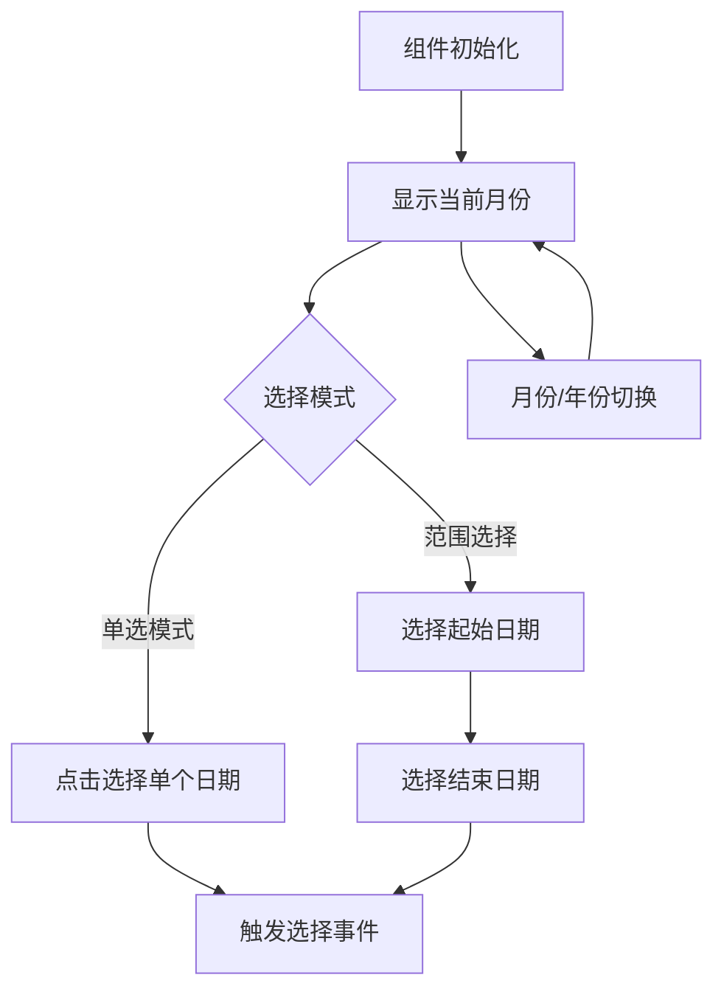

## 1. 产品概述
日历组件是一个通用的日期选择器组件，支持单日期选择和日期范围选择功能。该组件采用CSS变量进行样式定制，遵循统一的类前缀命名规范，可灵活集成到各类前端项目中。

目标用户：需要日期选择功能的开发者和产品经理，适用于表单、预约、数据分析等场景。

## 2. 核心功能

### 2.1 功能模块
我们的日历组件包含以下主要功能：
1. **单日期选择**：用户可点击选择单个日期
2. **日期范围选择**：用户可选择起始和结束日期
3. **月份导航**：支持上一月、下一月切换
4. **年份导航**：支持年份快速切换
5. **今日标记**：高亮显示当前日期
6. **禁用日期**：支持设置不可选择的日期
7. **自定义样式**：通过CSS变量进行主题定制

### 2.2 页面详情
| 页面名称 | 模块名称 | 功能描述 |
|---------|---------|---------|
| 日历组件 | 日历头部 | 显示当前年月，提供月份和年份切换按钮 |
| 日历组件 | 星期标题 | 显示周一到周日的星期标识 |
| 日历组件 | 日期网格 | 以网格形式展示当月所有日期，支持点击选择 |
| 日历组件 | 选择模式 | 支持单选和范围选择两种模式切换 |
| 日历组件 | 样式定制 | 通过CSS变量自定义颜色、字体、间距等样式 |

## 3. 核心流程
用户操作流程：
1. 用户打开包含日历组件的页面
2. 组件默认显示当前月份，高亮今日日期
3. 用户可通过点击选择单个日期（单选模式）
4. 或选择起始日期后选择结束日期（范围选择模式）
5. 选中的日期会高亮显示，范围选择的起止日期用不同颜色区分
6. 用户可通过月份/年份导航切换到其他时间段

## 4. 用户界面设计

### 4.1 设计规范
- **类前缀命名**：所有CSS类名使用统一前缀（如 `.cal-`）
- **CSS变量命名**：使用语义化变量名（如 `--cal-primary-color`）
- **响应式设计**：支持不同屏幕尺寸自适应
- **无障碍支持**：支持键盘导航和屏幕阅读器

### 4.2 样式变量
| 变量名 | 默认值 | 描述 |
|--------|--------|------|
| `--cal-primary-color` | #007bff | 主色调，用于选中状态 |
| `--cal-secondary-color` | #6c757d | 辅助色，用于悬停状态 |
| `--cal-text-color` | #333 | 文字颜色 |
| `--cal-border-color` | #dee2e6 | 边框颜色 |
| `--cal-font-size` | 14px | 字体大小 |
| `--cal-padding` | 8px | 内边距 |

### 4.3 组件结构
- **容器**：`.cal-container` - 组件最外层容器
- **头部**：`.cal-header` - 包含月份年份显示和导航按钮
- **星期栏**：`.cal-weekdays` - 显示星期标题
- **日期网格**：`.cal-days` - 日期网格容器
- **日期单元**：`.cal-day` - 单个日期单元格
- **选中状态**：`.cal-selected` - 选中日期样式
- **范围选择**：`.cal-range-start`、`.cal-range-end`、`.cal-range-middle` - 范围选择样式

### 4.4 交互状态
- **默认状态**：正常显示日期
- **悬停状态**：鼠标悬停时的视觉效果
- **选中状态**：用户点击选择后的高亮效果
- **禁用状态**：不可选择日期的置灰效果
- **今日状态**：当前日期的特殊标识