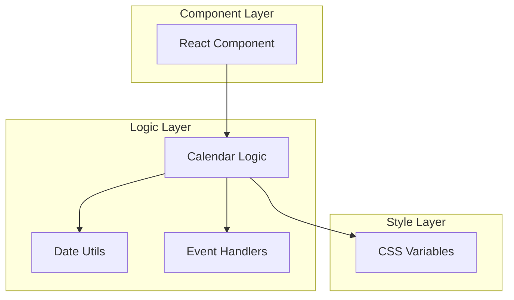

## 1. 架构设计



## 2. 技术描述

* **前端框架**: React\@18 + TypeScript

* **样式方案**: CSS Modules + CSS Variables

* **构建工具**: Vite

* **初始化工具**: vite-init

* **日期处理**: 原生JavaScript Date API

* **后端**: 无（纯前端组件）

## 3. 组件接口定义

### 3.1 Props 接口

```typescript
interface CalendarProps {
  // 选择模式
  mode?: 'single' | 'range';
  
  // 当前选中值
  value?: Date | [Date, Date] | null;
  
  // 默认显示月份
  defaultMonth?: Date;
  
  // 禁用日期函数
  disabledDate?: (date: Date) => boolean;
  
  // 选择回调函数
  onChange?: (value: Date | [Date, Date] | null) => void;
  
  // 自定义类名前缀
  classNamePrefix?: string;
  
  // 自定义样式
  style?: React.CSSProperties;
  
  // 自定义CSS变量
  cssVariables?: Record<string, string>;
}
```

### 3.2 组件状态

```typescript
interface CalendarState {
  // 当前显示月份
  currentMonth: Date;
  
  // 选中值
  selectedValue: Date | [Date, Date] | null;
  
  // 范围选择临时值
  rangeTempValue?: Date | null;
  
  // 选择阶段（范围模式）
  selectionPhase: 'start' | 'end';
}
```

## 4. 组件实现

### 4.1 核心方法

```typescript
// 获取月份天数
getDaysInMonth(date: Date): number

// 获取月份第一天是星期几
getFirstDayOfMonth(date: Date): number

// 生成日历数据
generateCalendarData(month: Date): CalendarDay[][]

// 处理日期点击
handleDateClick(date: Date): void

// 处理月份切换
handleMonthChange(direction: 'prev' | 'next'): void

// 判断日期是否禁用
isDateDisabled(date: Date): boolean

// 判断日期是否选中
isDateSelected(date: Date): boolean

// 判断日期是否在范围内
isDateInRange(date: Date): boolean
```

### 4.2 CSS变量定义

```css
:root {
  /* 颜色变量 */
  --cal-primary-color: #007bff;
  --cal-primary-hover: #0056b3;
  --cal-secondary-color: #6c757d;
  --cal-text-color: #333;
  --cal-text-muted: #6c757d;
  --cal-border-color: #dee2e6;
  --cal-background: #fff;
  --cal-disabled-bg: #f8f9fa;
  --cal-disabled-text: #6c757d;
  --cal-today-bg: #e3f2fd;
  --cal-today-text: #1976d2;
  
  /* 尺寸变量 */
  --cal-font-size: 14px;
  --cal-header-height: 40px;
  --cal-day-size: 32px;
  --cal-border-radius: 4px;
  --cal-padding: 8px;
  --cal-gap: 2px;
  
  /* 动画变量 */
  --cal-transition-duration: 0.2s;
  --cal-transition-timing: ease-in-out;
}
```

### 4.3 样式结构

```css
/* 容器 */
.cal-container {
  display: inline-block;
  background: var(--cal-background);
  border: 1px solid var(--cal-border-color);
  border-radius: var(--cal-border-radius);
  font-size: var(--cal-font-size);
  font-family: inherit;
}

/* 头部 */
.cal-header {
  display: flex;
  align-items: center;
  justify-content: space-between;
  height: var(--cal-header-height);
  padding: 0 var(--cal-padding);
  border-bottom: 1px solid var(--cal-border-color);
}

/* 星期栏 */
.cal-weekdays {
  display: grid;
  grid-template-columns: repeat(7, 1fr);
  gap: var(--cal-gap);
  padding: var(--cal-padding);
  background: var(--cal-disabled-bg);
}

/* 日期网格 */
.cal-days {
  display: grid;
  grid-template-columns: repeat(7, 1fr);
  gap: var(--cal-gap);
  padding: var(--cal-padding);
}

/* 日期单元 */
.cal-day {
  display: flex;
  align-items: center;
  justify-content: center;
  width: var(--cal-day-size);
  height: var(--cal-day-size);
  border-radius: var(--cal-border-radius);
  cursor: pointer;
  transition: all var(--cal-transition-duration) var(--cal-transition-timing);
}
```

## 5. 使用示例

### 5.1 单选模式

```tsx
import Calendar from './Calendar';

function SingleSelectExample() {
  const [selectedDate, setSelectedDate] = useState<Date | null>(null);
  
  return (
    <Calendar
      mode="single"
      value={selectedDate}
      onChange={setSelectedDate}
      classNamePrefix="my-app"
      cssVariables={{
        '--cal-primary-color': '#ff6b6b',
        '--cal-font-size': '16px'
      }}
    />
  );
}
```

### 5.2 范围选择模式

```tsx
import Calendar from './Calendar';

function RangeSelectExample() {
  const [dateRange, setDateRange] = useState<[Date, Date] | null>(null);
  
  const disabledDate = (date: Date) => {
    return date < new Date(); // 禁用过去的日期
  };
  
  return (
    <Calendar
      mode="range"
      value={dateRange}
      onChange={setDateRange}
      disabledDate={ }
      defaultMonth={new Date()}
    />
  );
}
```

## 6. 性能优化

### 6.1 渲染优化

* 使用 `React.memo` 避免不必要的重渲染

* 日期数据使用 `useMemo` 缓存计算结果

* 事件处理函数使用 `useCallback` 缓存

### 6.2 样式优化

* CSS变量支持运行时主题切换

* 使用CSS Grid实现灵活的布局

* 支持CSS Modules避免样式冲突

### 6.3 可访问性

* 支持键盘导航（方向键、Enter键）

* 提供ARIA标签支持屏幕阅读器

* 支持高对比度模式

