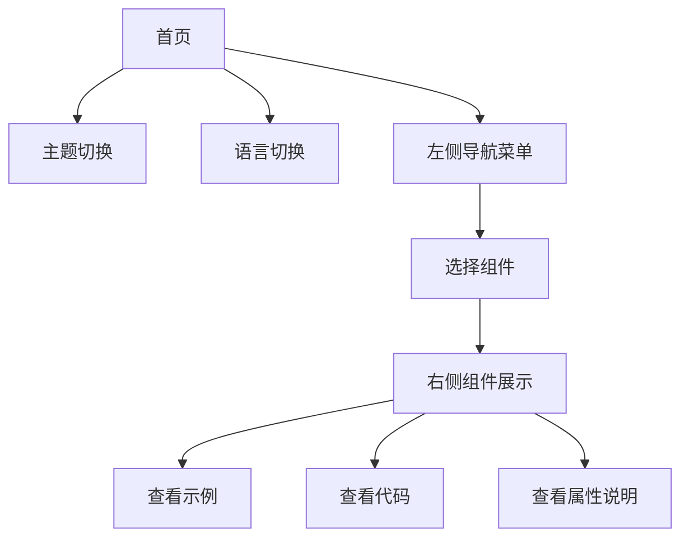

## 1. 产品概述
Zephyr UI 组件库展示官网是一个专业的组件库演示平台，用于展示和演示 Zephyr UI 组件库的所有组件功能。该平台帮助开发者快速了解和使用组件库中的各种 UI 组件，提供直观的交互体验和详细的组件文档。

目标用户为前端开发者、UI 设计师和产品经理，通过可视化的方式展示组件用法，提高开发效率和设计一致性。

## 2. 核心功能

### 2.1 用户角色
| 角色 | 注册方式 | 核心权限 |
|------|----------|----------|
| 访客用户 | 无需注册 | 浏览所有组件示例、查看组件代码、切换主题和语言 |

### 2.2 功能模块
组件库展示官网包含以下核心页面：
1. **首页**: 品牌展示、组件导航、主题切换、语言切换
2. **组件展示页**: 左侧导航菜单、右侧组件示例卡片、代码展示区域

### 2.3 页面详情
| 页面名称 | 模块名称 | 功能描述 |
|-----------|-------------|-------------|
| 首页 | 品牌头部区域 | 展示 Zephyr UI 品牌标识、主题切换按钮（深色/浅色）、语言切换按钮（中文/英文） |
| 首页 | 页面布局容器 | 采用左右分栏布局，左侧为组件导航菜单，右侧为组件展示内容区 |
| 组件展示页 | 左侧导航菜单 | 按组件类别分组展示所有可用组件，支持点击跳转到对应组件示例 |
| 组件展示页 | 组件示例卡片 | 为每个组件创建独立的展示卡片，包含组件标题、功能描述、交互示例 |
| 组件展示页 | 代码展示区域 | 展示组件的使用代码示例，支持代码高亮和复制功能 |
| 组件展示页 | 属性说明表格 | 展示组件的 Props 参数说明，包含参数名、类型、默认值、描述 |

## 3. 核心流程
用户访问官网后，首先看到品牌头部区域，可以通过主题切换按钮切换深色/浅色模式，通过语言切换按钮切换中英文。在左侧导航菜单中选择想要查看的组件，右侧内容区会显示该组件的详细示例、代码和属性说明。

## 4. 用户界面设计

### 4.1 设计风格
- **主色调**: 深蓝色 (#1e40af) 作为主品牌色，配合灰色系 (#6b7280, #374151) 作为辅助色
- **按钮样式**: 采用现代化的圆角设计，边框半径 8px，支持 hover 和 active 状态变化
- **字体**: 使用系统默认字体栈，标题 24-32px，正文 14-16px，代码 12-14px
- **布局风格**: 卡片式布局，每个组件示例独立成卡片，间距统一使用 8 的倍数
- **图标风格**: 使用简洁的线性图标，与整体现代简约风格保持一致

### 4.2 页面设计概览
| 页面名称 | 模块名称 | UI 元素 |
|-----------|-------------|-------------|
| 首页 | 品牌头部 | 左侧 Zephyr UI logo（24px 字体大小），右侧主题切换图标按钮和语言切换下拉菜单，背景色根据主题变化 |
| 首页 | 左侧导航 | 宽度 280px 的侧边栏，组件按类别分组（基础组件、数据录入、数据展示、反馈组件），选中项高亮显示 |
| 首页 | 右侧内容 | 自适应内容区域，每个组件示例采用白色卡片（深色模式下为深灰色），卡片内边距 24px，圆角 12px |
| 组件卡片 | 标题区域 | 组件名称（20px 粗体）、组件描述（14px 灰色文字）、分割线 |
| 组件卡片 | 示例区域 | 组件交互演示区域，最小高度 120px，居中显示组件 |
| 组件卡片 | 代码区域 | 语法高亮的代码块，支持一键复制，背景色 #f8fafc（深色模式 #1f2937） |

### 4.3 响应式设计
采用桌面端优先的设计策略，确保在 1440px 及以上分辨率下获得最佳体验。支持平板端自适应，在移动端采用汉堡菜单收起左侧导航，主要内容区域保持单列布局。所有交互元素都针对触摸操作进行优化，按钮最小点击区域 44px。