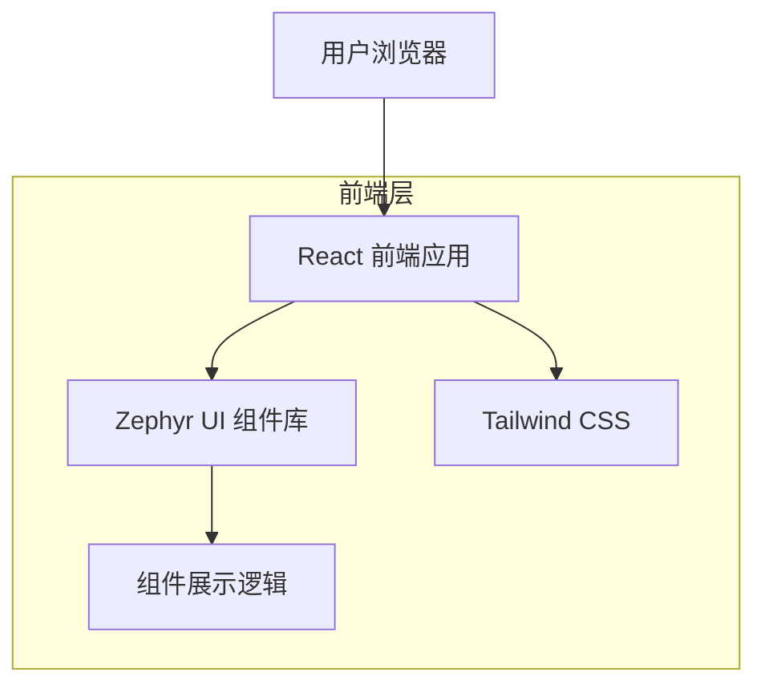

## 1. 架构设计



## 2. 技术描述

* **前端**: React\@18 + TypeScript + Tailwind CSS\@3 + Vite

* **初始化工具**: vite-init

* **UI 组件库**: Zephyr UI (内部组件库)

* **样式方案**: Tailwind CSS 原子化 CSS 框架

* **代码高亮**: Prism.js 或类似语法高亮库

* **构建工具**: Vite (开发服务器 + 构建)

## 3. 路由定义

| 路由                         | 用途                  |
| -------------------------- | ------------------- |
| /                          | 首页，展示组件库整体介绍和快速开始   |
| /components                | 组件总览页面，左侧导航展示所有组件   |
| /components/:componentName | 具体组件展示页面，显示该组件的所有示例 |

## 4. 目录结构设计

```
examples/react-vite/src/
├── App.tsx                 # 主应用组件，包含主题和语言配置
├── main.tsx               # 应用入口文件
├── components/            # 展示官网专用组件
│   ├── Layout/           # 布局组件
│   │   ├── Header.tsx    # 品牌头部，包含主题和语言切换
│   │   ├── Sidebar.tsx   # 左侧导航菜单
│   │   └── Content.tsx   # 右侧内容区域
│   ├── ComponentCard/    # 组件展示卡片
│   │   └── ComponentCard.tsx
│   └── CodeBlock/        # 代码展示块
│       └── CodeBlock.tsx
├── pages/                # 页面组件
│   ├── Home.tsx         # 首页
│   └── Components.tsx   # 组件展示页
├── hooks/               # 自定义 Hooks
│   ├── useTheme.ts     # 主题切换逻辑
│   └── useLocale.ts    # 国际化切换逻辑
├── utils/              # 工具函数
│   ├── componentData.ts # 组件数据配置
│   └── codeExamples.ts  # 代码示例配置
└── types/              # TypeScript 类型定义
    └── index.ts
```

## 5. 组件数据结构

### 5.1 组件配置类型定义

```typescript
interface ComponentConfig {
  name: string;           // 组件名称
  category: string;       // 组件分类
  description: string;    // 组件描述
  examples: ComponentExample[]; // 示例数组
  props: ComponentProp[];     // Props 说明
}

interface ComponentExample {
  title: string;          // 示例标题
  description: string;    // 示例描述
  code: string;         // 代码示例
  component: React.ComponentType; // 展示的组件
}

interface ComponentProp {
  name: string;         // 属性名
  type: string;         // 类型
  defaultValue: string; // 默认值
  description: string;  // 描述
  required: boolean;    // 是否必填
}
```

### 5.2 组件分类配置

```typescript
graph TD
  A[用户浏览器] --> B[React 前端应用]
  B --> C[Zephyr UI 组件库]
  B --> D[Tailwind CSS]
  C --> E[组件展示逻辑]

  subgraph "前端层"
    B
    C
    D
    E
  end
```

## 6. 核心组件实现

### 6.1 主题切换逻辑

```typescript
// hooks/useTheme.ts
import { useState, useEffect } from 'react';

export const useTheme = () => {
  const [theme, setTheme] = useState<'light' | 'dark'>('light');
  
  useEffect(() => {
    const savedTheme = localStorage.getItem('zephyr-theme');
    if (savedTheme) {
      setTheme(savedTheme as 'light' | 'dark');
    }
  }, []);
  
  const toggleTheme = () => {
    const newTheme = theme === 'light' ? 'dark' : 'light';
    setTheme(newTheme);
    localStorage.setItem('zephyr-theme', newTheme);
  };
  
  return { theme, toggleTheme };
};
```

### 6.2 国际化切换逻辑

```typescript
// hooks/useLocale.ts
import { useState, useEffect } from 'react';
import { zhCN, enUS } from '@zephyr/ui';

export const useLocale = () => {
  const [locale, setLocale] = useState(zhCN);
  const [language, setLanguage] = useState<'zh' | 'en'>('zh');
  
  useEffect(() => {
    const savedLang = localStorage.getItem('zephyr-language');
    if (savedLang) {
      setLanguage(savedLang as 'zh' | 'en');
      setLocale(savedLang === 'en' ? enUS : zhCN);
    }
  }, []);
  
  const toggleLanguage = () => {
    const newLang = language === 'zh' ? 'en' : 'zh';
    setLanguage(newLang);
    setLocale(newLang === 'en' ? enUS : zhCN);
    localStorage.setItem('zephyr-language', newLang);
  };
  
  return { locale, language, toggleLanguage };
};
```

## 7. 页面布局结构

### 7.1 主应用布局

```typescript
// App.tsx
import { ConfigProvider } from '@zephyr/ui';
import { useTheme } from './hooks/useTheme';
import { useLocale } from './hooks/useLocale';
import Layout from './components/Layout';

function App() {
  const { theme } = useTheme();
  const { locale } = useLocale();
  
  return (
    <ConfigProvider theme={theme} locale={locale}>
      <Layout />
    </ConfigProvider>
  );
}
```

### 7.2 布局组件结构

```typescript
// components/Layout/index.tsx
import Header from './Header';
import Sidebar from './Sidebar';
import Content from './Content';

export default function Layout() {
  return (
    <div className="min-h-screen bg-gray-50 dark:bg-gray-900">
      <Header />
      <div className="flex">
        <Sidebar className="w-280px flex-shrink-0" />
        <Content className="flex-1 ml-280px" />
      </div>
    </div>
  );
}
```

## 8. 性能优化策略

### 8.1 组件懒加载

使用 React.lazy 和 Suspense 实现组件的按需加载，减少初始bundle大小。

### 8.2 代码分割

按组件类别进行代码分割，用户访问特定组件时才加载对应代码。

### 8.3 缓存策略

利用浏览器缓存存储主题和语言偏好，避免重复请求。

### 8.4 图片优化

所有图标使用 SVG 格式，支持主题切换时的颜色变化，无需多张图片。
